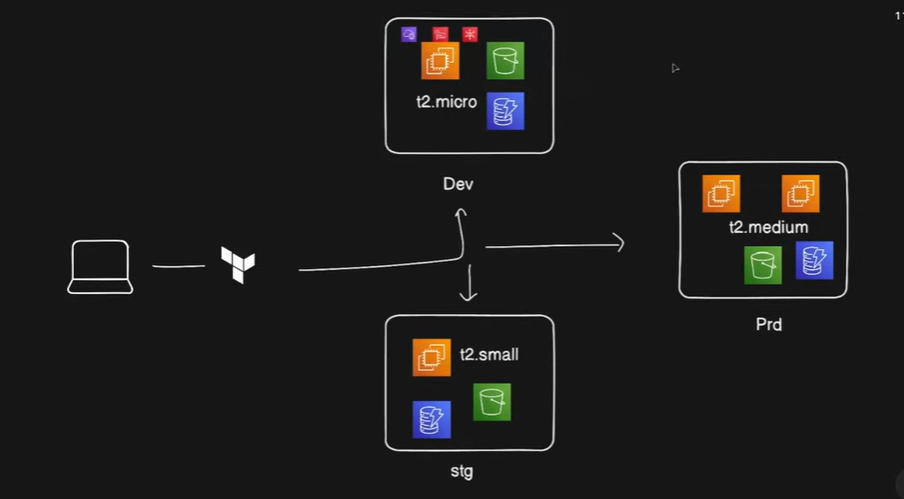

# terraform-modules-app

<p align="center">
	
</p>

> A reusable Terraform project that builds environment-specific AWS infrastructure from one clean module design.

## Overview

This project provisions `dev`, `stage`, and `prod` environments from a single reusable Terraform module. The root configuration stays intentionally small and delegates the actual AWS resource creation to `infra-app`, which is where the infrastructure logic lives.

## What This Project Does

The root module instantiates the same infrastructure three times with different environment values:

- `dev` with smaller capacity
- `stage` with environment-specific naming
- `prod` with higher capacity and a larger root volume

Each environment gets its own set of AWS resources through the same reusable code path. That keeps the design DRY, predictable, and easy to extend.

Inside `infra-app`, the module creates:

- an EC2 key pair from a local public key file
- a security group with SSH and HTTP access
- one or more EC2 instances controlled by `instance_count`
- an S3 bucket with environment-prefixed naming
- a DynamoDB table with a configurable hash key

## Architecture At A Glance

This diagram represents the basic layout of the system built by this repository:

- one Terraform root module
- one reusable child module (`infra-app`)
- three environment deployments driven by different variable values
- EC2, S3, and DynamoDB provisioned in a consistent pattern

If you want the image to render in GitHub, save the diagram in the repo at:

- `terraform-modules-app/docs/terraform-modules-app-architecture.png`

Then this README will automatically display it through the image tag at the top.

## Why This Is a Strong Terraform Example

This repo shows more than just “I can create AWS resources.” It demonstrates that the infrastructure is organized around real reusable Terraform patterns:

- **Module design**: the same module is reused for multiple environments instead of copy-pasting resource blocks
- **Environment isolation**: resource names are parameterized with `env` so dev, stage, and prod stay distinct
- **Input-driven infrastructure**: instance sizing, AMI selection, bucket naming, and table keys are all controlled through variables
- **Resource dependency management**: EC2 depends on the key pair and security group, which keeps the provisioning order explicit
- **Practical AWS composition**: compute, networking, storage, and DynamoDB are all represented in one cohesive app
- **Terraform fundamentals used correctly**: variables, `count`, `depends_on`, `file()`, interpolation, tags, and module calls are all in use

If someone reviews this repo, the main signal is that the author understands how to structure Terraform for reusable, environment-aware infrastructure instead of just writing one-off scripts.

## Why It Stands Out

This is the kind of repository that tells a hiring manager you understand infrastructure as code as a system, not as isolated files:

- you separate orchestration from implementation
- you use module inputs to shape infrastructure behavior
- you keep naming and tagging environment-aware
- you model real AWS building blocks together instead of in isolation
- you show a clean path from local developer setup to cloud provisioning

## Repository Layout

- `terraform.tf` sets the AWS provider and region
- `main.tf` creates three module instances: `dev-infra`, `stage-infra`, and `prod-infra`
- `infra-app/ec2.tf` defines EC2, the security group, and the key pair
- `infra-app/s3.tf` defines the S3 bucket
- `infra-app/dynamodb.tf` defines the DynamoDB table
- `infra-app/variables.tf` defines the module inputs

## How It Works

The root configuration passes a different set of values into the module for each environment:

- `env` controls naming and tagging
- `bucket_name` controls the S3 bucket name suffix
- `instance_count` controls how many EC2 instances are created
- `instance_type` controls the EC2 size
- `ec2_ami_id` controls the machine image used for EC2
- `hash_key` controls the DynamoDB partition key name

That means the same module can build three different stacks without changing the module code itself.

## Skills This Demonstrates

This project shows practical Terraform ability in areas that matter in real teams:

- multi-environment infrastructure design
- reusable module architecture
- AWS resource provisioning
- variable-driven configuration
- tagging and naming conventions
- instance lifecycle control with `count`
- safe dependency ordering with `depends_on`
- separation of root orchestration from module implementation

## How To Run

From the `terraform-modules-app` directory:

```bash
terraform init
terraform plan
terraform apply
```

To destroy everything later:

```bash
terraform destroy
```

## Suggested Screenshot Placement

To make the README render the diagram, place the image here:

```text
terraform-modules-app/docs/terraform-modules-app-architecture.png
```

That keeps the documentation self-contained and visually clear when someone opens the repository.

## Important Notes

- The module expects a valid AWS account, credentials, and permissions for EC2, VPC, S3, and DynamoDB.
- The EC2 key pair is created from the local file `terra-key-ec2.pub`, so that file must stay alongside the root module.
- The selected AMI and instance type must be valid for the configured AWS region.

## Short Version

This is a reusable, environment-aware Terraform app that provisions AWS compute, storage, networking, and a DynamoDB table through a single module pattern. It is structured to show strong Terraform fundamentals, not just resource creation.